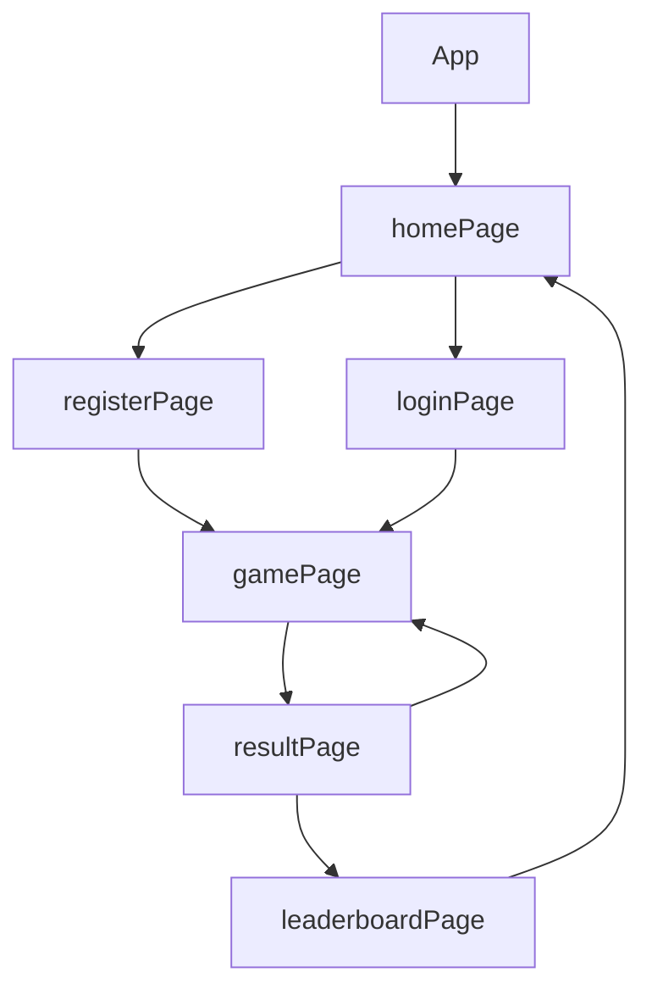

<!-- # Image-Editor -->

> 💻 PROJECT CODE ⭐⭐⭐
<h1>✨closed-minute-1314✨</h1>

> 💻 PROJECT NAME ⭐⭐⭐ 
<h1>🃏21 Lucky Game🃏</h1>
<br/>

[](https://github.com/avinash7488/gameBackend)
[](https://crazy-tan-ray.cyclic.app/)
[](https://21-lucky-game.vercel.app/)

<!--  -->

## OBJECTIVE✨

> 21 Lucky Game is a real time full stack single player game. This game is build with the help of MERN Stack, also incorporating dynamic animation to create an immersive gaming experience.

---

## DESCRIPTION✨

- The objective of the game is to get a set of cards in which the sum must be 21. Or you can get as close as possible without bursting if you go over 21, you     lose, if the dealer has 21 or less and you have less points than the dealer, you lose.

- The repo includes both client-side and server-side.

---

## RUN the Game✨

1. Clone this repository.
2. Open the terminal and navigate to the folder.
3. Run the following command to install dependencies:

  ```
  npm install
  ```

4. Run the following command to run the game:

  ```
  npm run dev
  ```

5. Enjoy!

---

## TECH-STACK💫

- #### For Frontend :

  - `HTML5`
  - `CSS3`
  - `JavaScript`
  - `ReactJS`
  - `TypeScript`

- #### For Backend :

  - `NodeJS`
  - `ExpressJS`
  - `MongoDB `

- #### For Styling :

  - `Chakra UI `
  - `CSS-Animations`

- #### For deploying database :

  - `cyclic `

- #### For live Project : -
  - `vercel`

---

## FEATURES✨

| Serial No | Feature                                                                           |
| --------- | --------------------------------------------------------------------------------- |
| 1         | User signup, User Login                                                           |
| 2         | Able to play the game                                                             |
| 3         | Able to see the score                                                             |
| 4         | Dynamic Leaderboard                                                               |

---

# package.json(Dependency)✨

| Serial No | Backend      | Frontend                     |
| --------- | ------------ | ---------------------------- |
| 1         | bcrypt       | chakra-ui                    |
| 2         | mongoose     | react-router-dom             |
| 3         | cors         | react-icons                  |
| 4         | dotenv       | axios                        |
| 5         | express      | typescript                   |
| 6         | jsonwebtoken | react-simple-chatbot         |

---

## Flow✨



## Creators Profile Links✨

| Creators                 | Github                                                                                                                                    | Linkedin                                                                                                                                                            | Portfolio                                                                                                                                     |
| ----------------------------- | ----------------------------------------------------------------------------------------------------------------------------------------- | ------------------------------------------------------------------------------------------------------------------------------------------------------------------- | --------------------------------------------------------------------------------------------------------------------------------------------- |
| Pallavi Jain | [](https://github.com/pallavijainy) | [](https://www.linkedin.com/in/pallavi-jain-64442a23a/) | [](https://pallavijainy.github.io/)  |
| Avinash kumar | [](https://github.com/avinash7488) | [](https://www.linkedin.com/in/avinash-kumar-b1005b230/)  | [](https://avinash7488.github.io/) |
| Raj Kumar Sahu | [](https://github.com/rajkumarsahu89) | [](https://www.linkedin.com/in/raj-kumar-sahu89/) | [](https://rajkumarsahu89.github.io/)     |

---

## Screenshots 📷
---


# HOME-PAGE
  - Home page includes the title of the game (21 Lucky Game) along with the feature to register a new user or to login an existing user, connected with the backend. After the login or registration is successfull, the player will be able to select a theme based on his/her choice and get notified with the help of a 'toast', and will be directly navigated to the 'Gaming Page'.

 

 


# GAME-PAGE
  
  - HOW TO PLAY :
    - The objective of the game is to get a set of cards in which the sum must be 21. Or you can get as close as possible without bursting if you go over 21, you        lose, if the dealer has 21 or less and you have less points than the dealer, you lose.
    - The numbered cards correspond to their respective value, the cards with letters, the situation changes a little, J, Q and K cards are worth 10 points.
       But "A" card has a value of 1.
    - When you start the game, you will decide if you want more cards, or if you want to keep the amount you received, if you want to take more cards, it may           happen that you exceed the score of 21, if that happens you will lose because the dealer will not ask for cards. But, if you still haven't exceeded, a timer       will appear for you to play in up to 6 seconds, if you don't do anything, you will lose your turn (stay).
    


  


# RESULT-PAGE
  - After the game ends the scores will be shown on this page.

  


# LEADERBOARD
  - The ranking of all the players registered with us will be shown here with their all time scores and level they have crossed.

  


---

## Reference✨

- [MDN DOCS](https://developer.mozilla.org/en-US/docs/Web/API/Canvas_API/Tutorial/Using_images)
- [Framer Motion](https://www.framer.com/motion/)

---

<h1 align="center">✨Thank You✨</h1>

